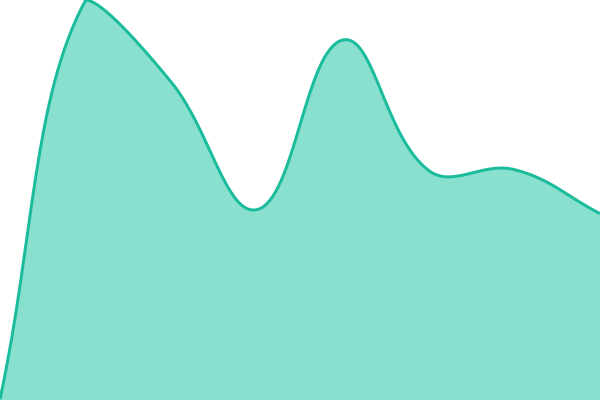
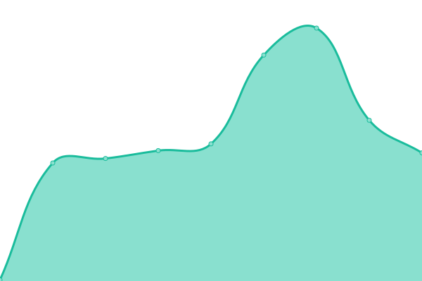
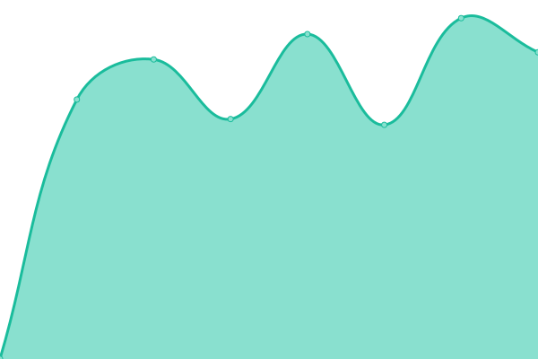
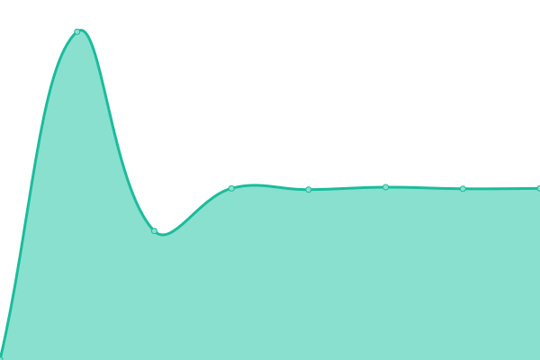
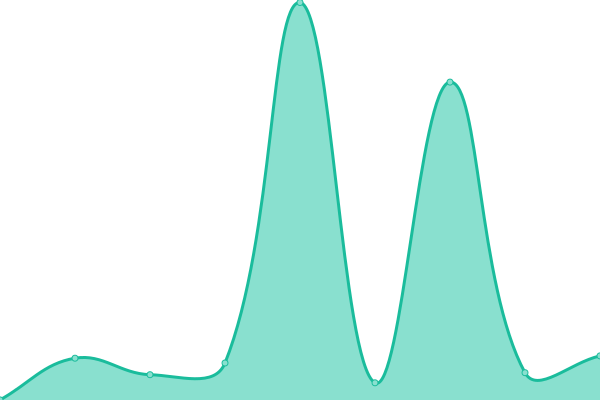

# [📈 Live Status](https://demo.upptime.js.org): <!--live status--> **🟧 Partial outage**

This repository contains the open-source uptime monitor and status page for [AgathonLi](https://demo.upptime.js.org), powered by [Upptime](https://github.com/upptime/upptime).

With [Upptime](https://upptime.js.org), you can get your own unlimited and free uptime monitor and status page, powered entirely by a GitHub repository. We use [Issues](https://github.com/AgathonLi/upptime/issues) as incident reports, [Actions](https://github.com/AgathonLi/upptime/actions) as uptime monitors, and [Pages](https://demo.upptime.js.org) for the status page.

<!--start: status pages-->
<!-- This summary is generated by Upptime (https://github.com/upptime/upptime) -->
<!-- Do not edit this manually, your changes will be overwritten -->
<!-- prettier-ignore -->
| URL | Status | History | Response Time | Uptime |
| --- | ------ | ------- | ------------- | ------ |
|  [Komari](https://status.uuui.uk) | 🟩 Up | [komari.yml](https://github.com/AgathonLi/upptime/commits/HEAD/history/komari.yml) | 

 587ms
     
 | 

<a href="https://upptime.uuui.uk/history/komari">100.00%</a>
    

|  [Nezha](https://status.990910.xyz) | 🟩 Up | [nezha.yml](https://github.com/AgathonLi/upptime/commits/HEAD/history/nezha.yml) | 

 2744ms
     
 | 

<a href="https://upptime.uuui.uk/history/nezha">98.93%</a>
    

|  [SnappyMail](https://mail.uuui.uk) | 🟩 Up | [snappy-mail.yml](https://github.com/AgathonLi/upptime/commits/HEAD/history/snappy-mail.yml) | 

 445ms
     
 | 

<a href="https://upptime.uuui.uk/history/snappy-mail">100.00%</a>
    

|  [CloudMail](https://mail.river-z.de) | 🟩 Up | [cloud-mail.yml](https://github.com/AgathonLi/upptime/commits/HEAD/history/cloud-mail.yml) | 

 349ms
     
 | 

<a href="https://upptime.uuui.uk/history/cloud-mail">100.00%</a>
    

|  [Cloudreve](https://sto.river-z.de) | 🟩 Up | [cloudreve.yml](https://github.com/AgathonLi/upptime/commits/HEAD/history/cloudreve.yml) | 

 601ms
     
 | 

<a href="https://upptime.uuui.uk/history/cloudreve">100.00%</a>
    

|  [EasyImage](https://pic-da.990910.xyz) | 🟩 Up | [easy-image.yml](https://github.com/AgathonLi/upptime/commits/HEAD/history/easy-image.yml) | 

 188ms
     
 | 

<a href="https://upptime.uuui.uk/history/easy-image">100.00%</a>
    

|  [Lsky Pro](https://pickr.211118.xyz) | 🟩 Up | [lsky-pro.yml](https://github.com/AgathonLi/upptime/commits/HEAD/history/lsky-pro.yml) | 

 1220ms
     
 | 

<a href="https://upptime.uuui.uk/history/lsky-pro">100.00%</a>
    

|  [Memos](https://note.211118.xyz) | 🟩 Up | [memos.yml](https://github.com/AgathonLi/upptime/commits/HEAD/history/memos.yml) | 

 2198ms
     
 | 

<a href="https://upptime.uuui.uk/history/memos">99.46%</a>
    

|  [Typecho](https://blog.210910.xyz) | 🟩 Up | [typecho.yml](https://github.com/AgathonLi/upptime/commits/HEAD/history/typecho.yml) | 

 738ms
     
 | 

<a href="https://upptime.uuui.uk/history/typecho">100.00%</a>
    

|  [MetaTube](https://ko0327-agathonli.koyeb.app) | 🟥 Down | [meta-tube.yml](https://github.com/AgathonLi/upptime/commits/HEAD/history/meta-tube.yml) | 

 2167ms
     
 | 

<a href="https://upptime.uuui.uk/history/meta-tube">71.33%</a>
    

<!--end: status pages-->

[**Visit our status website →**](https://demo.upptime.js.org)

## 📄 License

- Powered by: [Upptime](https://github.com/upptime/upptime)
- Code: [MIT](./LICENSE) © [Anand Chowdhary](https://anandchowdhary.com), supported by [Pabio](https://pabio.com)
- Data in the `./history` directory: [Open Database License](https://opendatacommons.org/licenses/odbl/1-0/)
